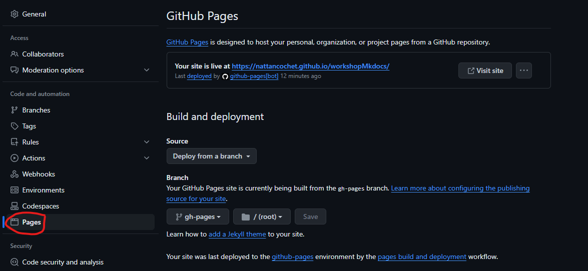
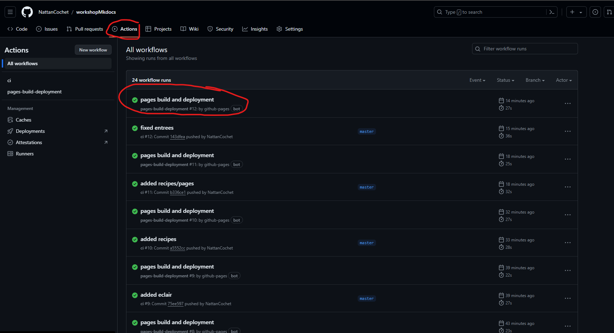
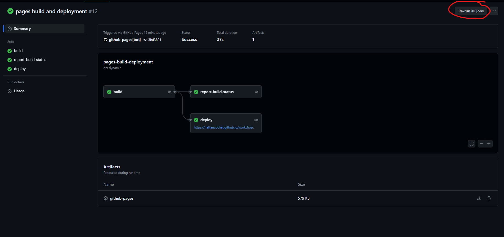

# Workshop mkdocs

## Installation

Installez MkDocs avec pip :

pip install mkdocs

Installez le thème Material :

pip install mkdocs-material

## Créer le projet

Créez un nouveau répo github public et clonez le

Utilisez mkdocs pour créer les fichiers de base :

```sh
mkdocs new .
```

Cela va créer un répertoire docs contenant un fichier index.md.

Ouvrez le fichier mkdocs.yml et configurez le thème material :

```yml
site_name: Mon super site trop bien
theme:
    name: material
```

## Écrire du contenu
Ajoutez/modifiez les fichiers Markdown dans le répertoire docs. Vous pouvez créer une arborescence de fichiers/dossiers comme vous le souhaitez.
Prévisualiser le rendu

**voir le [fichier](https://raw.githubusercontent.com/NattanCochet/workshopMkdocs/master/mkdocs.yml) donné avec le [site template](https://nattancochet.github.io/workshopMkdocs/)**

## Démarrez le serveur de développement

mkdocs serve

Ouvrez http://localhost:8000 dans votre navigateur pour prévisualiser les modifications.

Le serveur se met à jour automatiquement à chaque modification des fichiers.

## Personnalisation
Le fichier mkdocs.yml vous permet de personnaliser de nombreux aspects du site, comme les liens de navigation, l'en-tête/pied de page, les couleurs, fontes, etc.
Consultez la [documentation officielle](https://squidfunk.github.io/mkdocs-material/) pour tous les détails sur la configuration.

## Déploiement

Une fois votre documentation finalisée, vous pouvez la publier sur github pages avec le fichier .github/workflows/ci.yml ci dessous :

```yml
name: ci 
on:
  push:
    branches:
      - master 
      - main
permissions:
  contents: write
jobs:
  deploy:
    runs-on: ubuntu-latest
    steps:
      - uses: actions/checkout@v3
      - uses: actions/setup-python@v4
        with:
          python-version: 3.x
      - uses: actions/cache@v2
        with:
          key: ${{ github.ref }}
          path: .cache
      - run: pip install mkdocs-material
      - run: pip install pillow cairosvg
      - run: mkdocs gh-deploy --force
```

Pushez une première fois et allez dans vos paramètres de répo et activez le déploiement par branche :



Allez dans la section "actions de votre répo, cliquez sur la première entrée et faites "re-run all jobs"





Vous devriez pouvoir accéder à votre site une fois que l'action soit terminée!

Vous savez maintenant faire un site de documentation de qualité professionnelle simplement